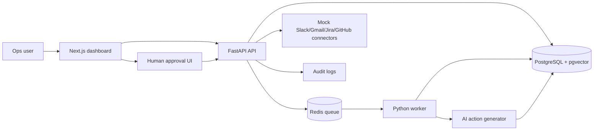

# OpsFlow AI

**AI Workflow Automation Platform for Ops Teams** — a production-style portfolio project built to demonstrate SDE/FDE readiness.

OpsFlow AI is not a basic chatbot. It is a Zapier-like internal ops command center where messy operational data is ingested, AI recommends actions, and humans approve/reject every external action before execution.

## Recruiter demo flow

1. Login with demo credentials.
2. Upload `sample_data/demo_tickets.csv`.
3. Watch the ingestion job move through the Redis worker pipeline.
4. Inspect AI-suggested actions with confidence, payload, and evidence.
5. Approve or reject actions.
6. See simulated Slack/Gmail/Jira/GitHub events and full audit logs.

## Demo credentials

```txt
Email: demo@opsflow.ai
Password: demo123
```

## Tech stack

- **Frontend:** Next.js, TypeScript, Tailwind CSS
- **Backend:** FastAPI, SQLAlchemy, Pydantic, JWT auth
- **Database:** PostgreSQL + pgvector extension
- **Queue:** Redis-backed ingestion queue + Python worker
- **AI layer:** deterministic local classifier/action generator for reproducible demos; replaceable with LLM APIs
- **Infra:** Docker Compose, GitHub Actions CI

## Features

- Demo login + JWT auth
- Workspace dashboard
- CSV ingestion
- Redis-backed asynchronous jobs
- Worker processing with job states: `queued`, `processing`, `completed`, `failed`
- AI action generation: customer reply drafts, escalations, tasks, Slack alerts, GitHub issues
- Human-in-the-loop approvals
- Audit timeline
- Action evidence panel
- Mock Slack/Gmail/Jira/GitHub connectors
- Simulated integration execution after approval
- Metrics: pending actions, approval rate, high-risk items, completed jobs, estimated time saved
- Dockerized local development
- Backend tests

## Run locally

```bash
cp .env.example .env
docker compose up --build
```

Open:

```txt
Frontend: http://localhost:3000
Backend:  http://localhost:8000
API docs: http://localhost:8000/docs
Health:   http://localhost:8000/health
```

If you are upgrading from Milestone 1, reset the local database once because Phase 2 adds new tables/columns:

```bash
docker compose down -v
docker compose up --build
```

## Sample upload format

Use `sample_data/demo_tickets.csv`.

Required columns:

```txt
title, body
```

Optional columns:

```txt
customer, channel, priority, status
```

## Architecture



## Why this project is resume-grade

This project demonstrates the kind of engineering recruiters and interviewers can actually inspect:

- Auth and role-like workflow boundaries
- Backend data modeling
- Queue + worker architecture
- Async ingestion pipeline
- API design
- Human-in-the-loop AI safety
- Auditability
- Integration simulation
- Production-ish Docker setup
- Clear demo story and business value

## Suggested resume bullets

- Built and deployed an AI workflow automation platform using Next.js, FastAPI, PostgreSQL/pgvector, Redis, and Docker, enabling ops teams to ingest support data and review AI-suggested actions through a human-in-the-loop approval workflow.
- Implemented Redis-backed async ingestion jobs with worker processing, job-state tracking, risk scoring, AI action generation, mock Slack/Gmail/Jira/GitHub integrations, and full audit logging.
- Designed an evidence-first action review UI showing confidence, source ticket evidence, execution payloads, simulated integration events, and metrics such as approval rate, high-risk items, and estimated time saved.

## Phase status

- **Milestone 1:** working full-stack skeleton
- **Phase 2:** async jobs, evidence panel, mock integrations, dashboard polish
- **Next:** real deployment, screenshots, 90-second demo video, LLM provider adapter, RBAC, production migrations
