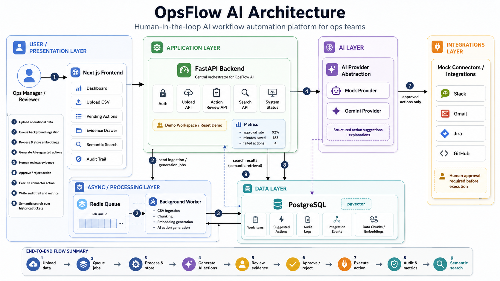

# OpsFlow AI

**Human-in-the-loop AI workflow automation platform for operations teams.**

OpsFlow AI ingests operational tickets, generates AI-backed action recommendations, lets a human reviewer inspect evidence, approve or reject actions, simulates connector execution, writes an audit trail, and supports semantic search across historical work items.

This project is built as a production-style full-stack system using **Next.js, FastAPI, PostgreSQL + pgvector, Redis workers, Docker Compose, and a provider-agnostic AI layer supporting mock and Gemini modes**.

---

## Why this project exists

Operations teams handle repetitive requests across support, billing, logistics, engineering, and internal workflows. Fully autonomous AI agents are risky in real business environments because they can take incorrect actions without accountability.

OpsFlow AI uses a safer workflow:

> AI recommends. Humans approve. Every action is auditable.

The system is designed around reliability, explainability, workflow safety, and production-readiness rather than just calling an LLM from a UI.

---

## Architecture



```txt
Upload CSV
   ↓
FastAPI backend creates ingestion job
   ↓
Redis queue dispatches background work
   ↓
Worker parses records and stores work items
   ↓
Embeddings are generated and stored in PostgreSQL + pgvector
   ↓
AI provider generates suggested actions
   ↓
Reviewer inspects evidence in the frontend
   ↓
Reviewer approves or rejects action
   ↓
Approved actions simulate connector execution
   ↓
Audit logs and metrics are updated
   ↓
Semantic search retrieves similar historical tickets
```

---

## Core Features

- **CSV ticket ingestion**
  - Upload operational work items from CSV.
  - Background processing converts records into structured work items.

- **Async processing pipeline**
  - Redis-backed job queue.
  - Background worker handles ingestion, chunking, embeddings, and AI action generation.

- **AI-generated suggested actions**
  - Classifies operational tickets.
  - Generates structured recommended actions.
  - Includes confidence, explanation, and payload.

- **Provider-agnostic AI layer**
  - `mock` provider for deterministic demos and tests.
  - `gemini` provider for real LLM-backed action generation.
  - Safe fallback behavior.

- **Human-in-the-loop review**
  - Pending actions require approval or rejection.
  - Evidence drawer shows source ticket, reasoning, payload, and execution context.
  - Reviewed actions cannot be arbitrarily changed.

- **Idempotent approval workflow**
  - Repeated approval requests do not create duplicate integration events.
  - Attempting to reject an already approved action returns a clean error.
  - Designed for safer workflow state transitions.

- **Mock connector execution**
  - Simulates Slack, Gmail, Jira, and GitHub connector actions.
  - Only approved actions are executed.

- **Audit trail**
  - Records ingestion, action generation, approval, rejection, and simulated execution events.
  - Provides visibility into workflow history.

- **Semantic ops search**
  - Uses stored ticket embeddings with PostgreSQL + pgvector.
  - Retrieves similar operational records.
  - Helps reviewers find related past issues.

- **Operational dashboard**
  - Metrics for work items, pending actions, approval rate, failed actions, and saved time.
  - System status card for database, Redis, and AI provider mode.

- **Resettable demo workspace**
  - One-click demo reset for clean product walkthroughs.

- **Dockerized local setup**
  - Full stack runs with Docker Compose.
  - Includes frontend, backend, PostgreSQL, Redis, and worker.

- **Backend CI**
  - GitHub Actions workflow runs backend smoke tests automatically on push and pull request.

---

## Tech Stack

| Layer | Technology |
|---|---|
| Frontend | Next.js, TypeScript |
| Backend | FastAPI, Python |
| Database | PostgreSQL |
| Vector Search | pgvector |
| Queue | Redis |
| Worker | Python background worker |
| AI Layer | Mock provider, Gemini provider |
| Auth | JWT-based demo auth |
| DevOps | Docker Compose |
| CI | GitHub Actions |

---

## System Design Highlights

### 1. Human approval before execution

OpsFlow AI does not execute AI recommendations directly. Every suggested action remains pending until a human reviewer approves it.

This is important for real operational workflows where incorrect automation can cause customer, financial, or engineering impact.

### 2. Provider-agnostic AI architecture

The backend does not depend directly on a single LLM provider. AI behavior is routed through a provider abstraction.

Supported modes:

```env
AI_PROVIDER=mock
AI_PROVIDER=gemini
```

The mock provider makes tests and demos deterministic. The Gemini provider enables real LLM-backed recommendations.

### 3. Idempotent action review

The approval workflow avoids duplicate side effects.

```txt
Approve once      → action approved, integration event created
Approve again     → same approved action returned, no duplicate event
Reject approved   → clean error
Reject pending    → action rejected
```

This is a key production-safety feature for workflow automation systems.

### 4. Semantic search with pgvector

Each ingested work item is converted into a stored embedding. The Search API retrieves related historical tickets using vector similarity with lightweight lexical boosting.

Example search queries:

```txt
refund payment failed
urgent outage
delivery delay
login OTP error
```

### 5. Auditability

Every important workflow event is recorded:

- CSV upload
- Job processing
- AI action generation
- Human approval
- Human rejection
- Simulated connector execution

This gives the system traceability and makes it more suitable for real business environments.

---

## Local Setup

### Prerequisites

Install:

- Docker Desktop
- Git

### 1. Clone the repository

```bash
git clone https://github.com/RajxPatil/OpsFlow-AI.git
cd OpsFlow-AI
```

### 2. Create environment file

```bash
cp .env.example .env
```

For deterministic local testing:

```env
AI_PROVIDER=mock
GEMINI_API_KEY=
GEMINI_MODEL=gemini-2.5-flash-lite
```

For Gemini mode:

```env
AI_PROVIDER=gemini
GEMINI_API_KEY=your_local_key_here
GEMINI_MODEL=gemini-2.5-flash-lite
```

Never commit real API keys.

### 3. Start the full stack

```bash
docker compose up --build -d
```

Check containers:

```bash
docker compose ps
```

### 4. Open the app

Frontend:

```txt
http://localhost:3000/dashboard
```

Backend health:

```txt
http://localhost:8000/health
```

API docs:

```txt
http://localhost:8000/docs
```

---

## Demo Login

```txt
Email: demo@opsflow.ai
Password: demo123
```

---

## Demo Flow

1. Open the dashboard.
2. Click **Reset Demo**.
3. Upload the sample CSV from `sample_data/`.
4. Wait for background ingestion to complete.
5. Review generated AI actions.
6. Click **Inspect** to view evidence and payload.
7. Approve or reject an action.
8. Check the audit trail and metrics.
9. Use semantic search to find related tickets.

Example semantic search queries:

```txt
refund payment failed
urgent outage
delivery delay
login OTP error
```

---

## API Overview

| Method | Endpoint | Purpose |
|---|---|---|
| `POST` | `/auth/login` | Demo login |
| `GET` | `/health` | Backend health check |
| `GET` | `/system/status` | API, database, Redis, and AI provider status |
| `POST` | `/demo/reset` | Reset demo workspace |
| `POST` | `/sources/upload_csv` | Upload operational CSV |
| `GET` | `/jobs` | List ingestion jobs |
| `GET` | `/workitems` | List work items |
| `GET` | `/actions` | List suggested actions |
| `GET` | `/actions/{id}` | Inspect action details and evidence |
| `POST` | `/actions/{id}/approve` | Approve suggested action |
| `POST` | `/actions/{id}/reject` | Reject suggested action |
| `GET` | `/search/work-items` | Semantic work item search |
| `GET` | `/workitems/{id}/similar` | Retrieve similar work items |
| `GET` | `/audit` | View audit trail |
| `GET` | `/metrics` | Dashboard metrics |

---

## Running Tests

Start the stack:

```bash
docker compose up --build -d
```

Run backend tests:

```bash
docker compose exec backend pytest -q
```

The smoke tests validate the core workflow:

```txt
login
reset demo
upload CSV
wait for worker completion
generate actions
inspect evidence
approve action
approve same action again safely
reject already approved action cleanly
semantic search
similar ticket retrieval
```

---

## Continuous Integration

This repository includes a GitHub Actions workflow:

```txt
.github/workflows/backend-ci.yml
```

CI runs on push and pull request to `main`.

The workflow:

1. Creates a safe CI `.env` file.
2. Builds Docker Compose services.
3. Waits for backend health.
4. Runs backend smoke tests inside the backend container.
5. Tears down services.

---

## Project Structure

```txt
.
├── backend
│   ├── app
│   │   ├── ai
│   │   │   ├── providers
│   │   │   │   ├── base.py
│   │   │   │   ├── gemini_provider.py
│   │   │   │   └── mock_provider.py
│   │   │   ├── schemas.py
│   │   │   └── service.py
│   │   ├── auth.py
│   │   ├── config.py
│   │   ├── database.py
│   │   ├── main.py
│   │   ├── models.py
│   │   ├── schemas.py
│   │   ├── services.py
│   │   └── worker.py
│   ├── tests
│   ├── Dockerfile
│   └── requirements.txt
│
├── frontend
│   ├── app
│   ├── Dockerfile
│   └── package.json
│
├── docs
│   └── assets
│       └── opsflow-ai-architecture.png
│
├── sample_data
├── docker-compose.yml
├── .env.example
└── README.md
```

---

## Engineering Decisions

### Mock provider for reliability

The mock AI provider keeps local demos and CI deterministic. This avoids flaky tests caused by network calls, rate limits, or model variability.

### Gemini provider for realistic AI behavior

Gemini mode enables real LLM-backed structured action generation while preserving the same backend contract.

### Docker Compose for reproducibility

The project uses Docker Compose so reviewers can run the complete system without manually installing PostgreSQL, Redis, or Python dependencies.

### pgvector for search extensibility

The semantic search layer is implemented with PostgreSQL + pgvector so the project can evolve toward production-grade embedding retrieval.

### Idempotent state transitions

Approval and rejection flows are implemented with safer workflow semantics to avoid duplicate connector execution.

---

## Current Status

Implemented:

- Full-stack dashboard
- CSV upload
- Background worker ingestion
- AI provider abstraction
- Mock AI mode
- Gemini AI mode
- Suggested actions
- Evidence drawer
- Human approval workflow
- Idempotent approve/reject behavior
- Mock connector execution
- Audit trail
- Metrics
- Semantic search
- Similar ticket retrieval
- Reset demo
- System status
- Docker Compose setup
- Backend smoke tests
- GitHub Actions CI

Planned:

- Production deployment
- Frontend CI build workflow
- Stronger pagination and filtering
- Role-based access control
- Real connector integrations
- Better observability and structured logs
- Evaluation set for AI suggestion quality

---

## Resume Summary

**OpsFlow AI — Human-in-the-loop AI workflow automation platform**

Built a full-stack AI workflow automation platform using Next.js, FastAPI, PostgreSQL/pgvector, Redis workers, Docker, and Gemini, enabling operations teams to ingest tickets, generate structured AI action recommendations, review evidence, approve or reject connector executions, and search similar historical issues.

Implemented async CSV ingestion, provider-agnostic AI architecture, semantic retrieval, approval workflow safety, mock Slack/Gmail/Jira/GitHub connectors, audit logs, metrics, resettable demo workspace, backend smoke tests, and GitHub Actions CI.

---

## License

This project is for portfolio and educational purposes.
