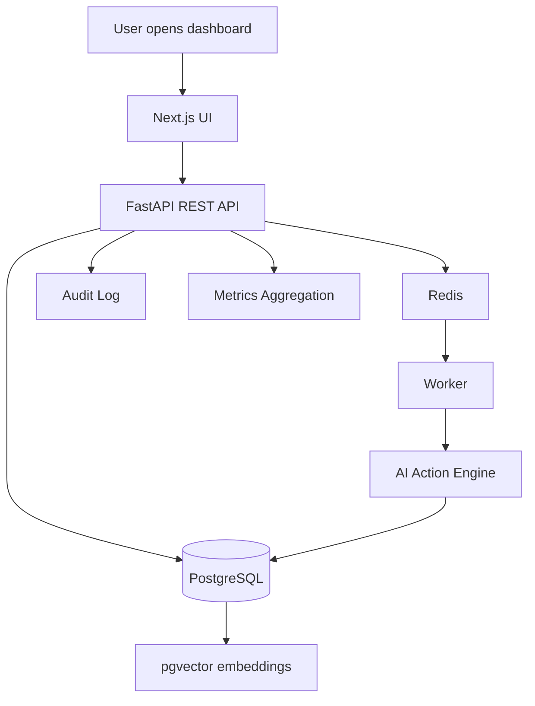

# OpsFlow AI Architecture

## Goal

OpsFlow AI demonstrates a real forward-deployed engineering style product: ingest messy operational data, convert it into structured work items, let an AI agent recommend workflow actions, and require human approval before execution.

## High-Level Architecture

## Data Flow

1. User logs into demo workspace.
2. User uploads CSV tickets.
3. Backend stores a DataSource and normalized WorkItems.
4. WorkItems are classified by the AI action engine.
5. SuggestedActions are created with type, confidence, explanation, and payload.
6. User approves or rejects actions.
7. Every mutation writes an AuditLog.
8. Metrics API aggregates platform outcomes.

## Human-in-the-Loop Safety

The AI engine never directly executes user-facing changes. It only proposes actions. Each suggestion requires explicit approval or rejection. This mirrors enterprise AI adoption patterns where trust, auditability, and control matter more than raw generation.

## Core Tables

- users
- workspaces
- data_sources
- work_items
- data_chunks
- suggested_actions
- audit_logs

## System-Design Talking Points

- Why PostgreSQL for relational workflow state?
- Why pgvector for semantic retrieval?
- Why Redis queues for slow ingestion and generation tasks?
- How would you scale background workers?
- How would you add Slack/Gmail/GitHub integrations?
- How do approval workflows reduce risk in AI automation?
- How are metrics and audit logs useful for enterprise adoption?
